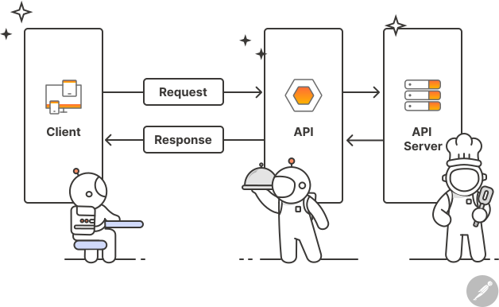
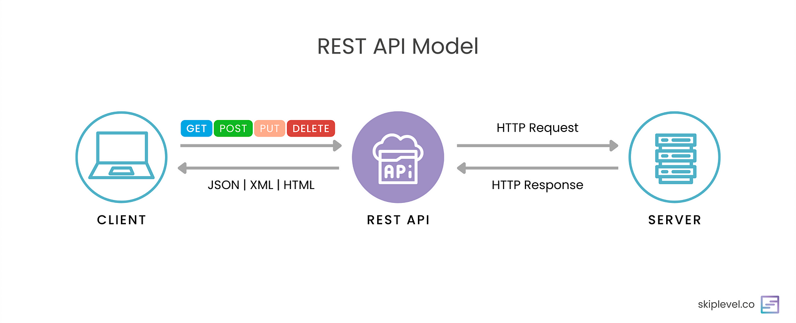

# API - my learnings

## contents :
what is API with analogy
Types
IMP Terminologies
Example
Methods , Status Code
How and where I use API ?

### API : 
APIs acts as the interface between the client and the server. 
Analogy :  Consider API like as a weater who serves you services you want 

To use API we need to know what we want we don't need to know how it works
Hence API also act as a abstraction layer between the client and the server

### Types of APIs

1. REST API
2. GraphQL API
3. SOAP API

### REST API

REST stands for Representational State Transfer. 
It is a type of API that uses HTTP requests to interact with a server and retrieve data. 
REST APIs are stateless, meaning that each request is independent of the previous one. 

Teminologies associated with API : 

### 1. Base URL : 
The URL that the API uses to communicate with the server.
With the help of URL we can request services to API .

### 2. Endpoints : 
The URL that the API uses to communicate with the server.
An API may have one or more endpoints, each of which corresponds to a specific resource or action.
For example, an API may have an endpoint for retrieving a list of products, an endpoint for creating a new product, and an endpoint for deleting a product.

### 3. Request : 
The HTTP request that the client sends to the server.

### 4. Response : 
The HTTP response that the server sends back to the client.

### 5. Status Code : 
The status code that the server sends back to the client to indicate the success or failure of the request.

### 6. API_KEY :(Optional) 
The API key is a unique identifier that the client uses to authenticate with the API. 
The API key is typically included in the request header as a bearer token.

### 7. Headers : 
The headers are used to pass additional information about the request or response. 
For example, the Content-Type header is used to specify the format of the data being sent or received.
REQUEST-RESPONSE IN API :

## Request
what is there in request ?
#### 1. Method : 
🔹 GET → Fetches data from the server (read-only).
🔹 POST → Sends data to the server to create a new resource.
🔹 PUT → Updates an existing resource or creates it if it doesn’t exist.
🔹 PATCH → Partially updates an existing resource.
🔹 DELETE → deletes  a resource from the server.
🔹 HEAD → Same as GET but without the response body (used to check metadata)

#### 2. URL : https://api.example.com/endpoint

#### 3. Headers : Content-Type , Authorization

#### 4. Body : JSON data

## Response
what is there in response ?
#### 1. Status Code : 
200 OK → Request was successful.
404 Not Found → The requested resource doesn't exist.
500 Internal Server Error → Generic server-side issue.

#### 2. Headers : Content-Type , Authorization

#### 3. Body : JSON data

## How and where I use API ?
#### Acessing trained ML model Via its API endpoint Using Flask
[Project Name](https://github.com/your-username/project-repo)[Project Name](https://github.com/your-username/project-repo)
#### Used Services like google map , Weather , news API in my web projects 
[Project Name](https://github.com/your-username/project-repo)
#### API can be used to get frequently updated or dynamic data 